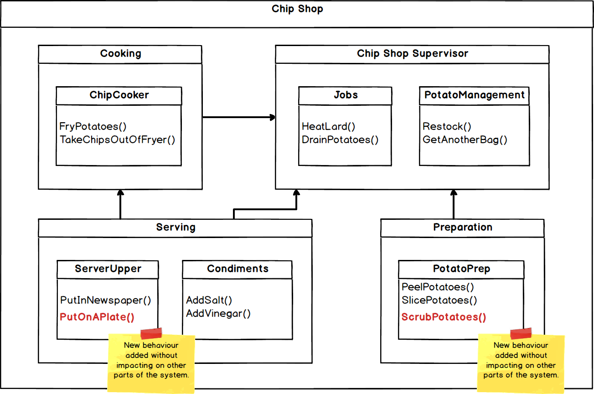

# SOLID Principles
**SOLID** is a mnemonic for some key design principles intended to make software more flexible and easier to work with. 

It stands for: 

* **S**ingle Responsibility Principle 
* **O**pen-Closed Principle  
* **L**iskov Substitution Principle  
* **I**nterface Segregation Principle 
* **D**ependency Inversion Principle 

------

[[_TOC_]]

------

## Single Responsibility Principle 

There are a lot of misunderstandings around this one. 

Many people think that it means that a class or a method should only do one thing. That *is* a good principle to follow and we absolutely should make methods which only have one job, but that is **not** what this is about. 

> Side note: If you have a large function that does lots of stuff, a good thing to do is refactor it into several smaller functions that each do one thing. This has lots of benefits; making the code easier to read, making it easier to unit test, making it simpler to maintain or improve, etc. If you find yourself writing functions like `MakeChipsAndWashCar()` then your function should be split.  

The Single Responsibility Principle (SRP) describes that **a class should have only one reason to change**. In other words it should be responsible to only one "actor" (also referred to as stakeholder or user or group, but these terms muddy the water). 

Consider the following scenario: 

Our class Andrew supports the following three methods: 

* `MakeBirthdayCake()` 
* `FixComputer()` 
* `WatchHighlander()` 

Consider that each of those methods might rely on the same **private** operation, such as `GetOffTheSofa()`. 

Andrew **violates** the Single Responsibility Principle because the three methods he supports are responsible to completely different people. Andrew is not responsible to only one. 

`MakeBirthdayCake()` is specifically for his wife, `FixComputer()` is invoked primarily by his mother, and `WatchHighlander()` is called for by the Millions Of Awesome People Who Agree That Highlander Is The Greatest Movie Ever Made, but they are all connected by the internals of the Andrew class. 

Andrew has now **coupled** his wife, his mother and the Millions Of Awesome People Who Agree That Highlander Is The Greatest Movie Ever Made, **to each other**, via **himself**. 

This is **bad**, because: 

* Changing the internal implementation of Andrew to support a change requested by his wife, may adversely affect the behaviour relied upon by his mother and the Millions Of Awesome People Who Agree That Highlander Is The Greatest Movie Ever Made.  
* It now means that different actors (stakeholders, users, groups) may be introducing requirements that result in changes to the same file. This can lead to merge conflicts and breakages.  

### How to Implement the Principle and Avoid Pitfalls 

There are several ways to avoid coupling your class to multiple things which might need it to change. Using our example above, the simplest way would be to create objects to support the operations that everyone needs Andrew to do, or **separate the data from the functions**.  

Consider the following scenario: 

In this way, a change to how birthday cakes are made will not affect how computers are fixed in any way. Andrew might still know how to `GetOff TheSofa()` but the other functionality is no longer coupled to that or each other. 

A pitfall with this approach is that developers now need to know how to instantiate and use three classes instead of one. A common pattern to deal with this is the Facade pattern. See https://www.dofactory.com/net/facade-design-pattern. 

It is also acknowledged that this can lead to some duplication or a lot of classes. Pragmatism is key. 

Another approach is to keep the most important function close to the data (i.e. in Andrew) and use this as a facade for the lesser functions. An example of how to do this can be found in the Clean Architecture book by Robert C. Martin. 

### Summary 

* The Single Responsibility Principle can be applied to functions or indeed whole components or applications, but is primarily concerned with classes and preventing changes to one behaviour from breaking other behaviours. 
* It does however crop up at an architectural level with the Common Closure Principle. When designing a component or a system, we should always think about what will have to change if requirements change. 

------

## Open-Closed Principle 

***"A software artifact should be open for extension but closed for modification."*** 
(Bertrand Meyer. Object Orientated Software Construction, Prentice Hall, 1988, p. 23.) 

***"What the hell does that mean?"*** 
(Me. My desk, 2020.) 

### Short Version

Simple changes to requirements shouldn't result in massive changes to the software. If they do, then there is a problem with the way that software is architected. (Case study, ask me some time about OSI and a PoC used for a production clinical study some time.) 

### How do we Achieve This? 

By separating the things that change for different reasons. There are a couple of things that can help with this. 

* By following the Single Responsibility Principle described above, we can ensure that changes to individual pieces of functionality do not impact upon others.  
* By organising the dependencies between classes and components properly.  
* Sensible architecture (see Onion architecture).  

Imagine we have a program that makes chips and serves the chips in newspaper with salt and vinegar. 

Consider the following complex program:  

Next thing we know, a requirement comes in to go upmarket and have the chips with the skin on as an option, and to serve them on a plate instead of in newspaper. 

We'll have to change our program. If we'd architected it differently, we'd probably have to change less code. 

We can separate out the different responsibilities into different areas of the application, so that changes in one area won't require changes in another. See below.  

From our example above, this might break down like this:  

By doing this, we can extend the functionality of individual parts of the application without affecting others:  

The thing to focus on is the direction of the dependencies. Everything depends on the Chip Shop Supervisor, because he/she knows the business **domain**. 

**If we want to protect the Chip Shop Supervisor from changes in other components, then the other components should depend on it - not the other way round.** 

The basic take-away (ha!) is that in the new architecture, the new requirement does not fundamentally change the way the chips are made, even though the end product is quite different.  

> Disclaimer: The example here is over-simplified and once you start to think about it you'd want all sorts of different things, maybe `IPotato`, `IChip` and implementations of `IChip` with maybe `RawChip` and `CookedChip` etc.  

### Summary 

* Changes in requirements should not result in massive changes to code. 
* Make your code **and** components easy to extend without resulting in high-impact changes. 
* Think about what dependencies you create and what hierarchy should result.  

------

## Liskov Substitution Principle 

This principle relates to inheritance. In the industry there has been a shift away from using inheritance (many pitfalls!), so you can probably skim this one if you're short on time. If however, you want to impress all of your friends, read on.  

The Liskov Substitution Principle (LSP) is designed to guide usage of inheritance. It states: 

***"If for each object o1 of type S there is an object o2 of type T such that for all programs P defined in terms of T, the behaviour of P is unchanged when o1 is substituted for o2 then S is a subtype of T."*** 
Barbara Liskov, "Data Abstraction and Hierarchy", SIGPLAN Notices 23, 5 (May 1988) 

### The Problem 

When using inheritance it is easy to violate the LSP and create coupling and unwanted dependencies. Consider the following: 

`Jaffacake` inherits from `Biscuit`, but it is not a proper subtype, because its behaviour is not like a `Biscuit`.  

`HungryPerson` thinks that they are enjoying a delicious crunchy `Biscuit`, but when given a `Jaffacake` they are not - so `HungryPerson` has to implement specific logic to deal with `Jaffacake`, rather than just knowing about `Biscuit`s. 

The behaviour of `HungryPerson` now depends on `Jaffacake`, so `Biscuit` and `Jaffacake` are not substitutable types. 

### The Solution 

Consider the following: 

`ChocolateHobnob`, `Jaffacake` and `MarshmallowSnowball` all inherit from `DeliciousTreat` but implement the `YummyFlavour` in their own way. 

The program above **conforms** to the Liskov Substitution Principle because `HungryPerson` does not depend on the implementation of the subtypes in any way. 

`HungryPerson` doesn't have to know anything about how the `YummyFlavour` is figured out, they just know about `DeliciousTreats` and how to enjoy the `YummyFlavour`.  

### Summary 

* The Liskov Substitution Principle has morphed into a broader recommendation for software architecture. By avoiding inheritance where possible and using interfaces it is easier to avoid the pitfalls.  
* It should be understood and borne in mind when designing a distributed architecture. Ask yourself, are you having to write code in one component to account for specifics in another?  

------

## Interface Segregation Principle 

The key here is to avoid dependency on things which have more than you need. This can couple classes or components together and make maintenance difficult.  

### The Problem 

Consider the following: 

`Delicates`, `Linens` and `T-Shirts` all use `WashingMachine`, but use different functions of the machine. The internals of `WashingMachine` may have shared functionality, such as `HeatWater` or `MixDetergent`. 

`Linens` and `T-Shirts` now inadvertently depend on the behaviour needed by `Delicates` (and vice-versa).  

A change to the behaviour in `WashAt30Degrees` which is only needed by `Delicates` may result in changes to the other operations and thus require `Linens` and `T-Shirts` to be updated. 

### The Solution 

Segregate the operations into interfaces as below. 

Now, `WashingMachine` still implements the same behaviours, but `Delicates`, `Linens` and `T-Shirts` only know about the behaviours they care about.  

### Summary 

* Segregation of behaviour through interfaces reduces coupling between classes. 
* This principle can also be applied to components in distributed architecture. 
* Beware the trap of premature optimisation or segregation when dealing with services or packages though! Ask me about some specific examples (e.g. pulling out NuGet packages for shared code too early). 

------

## Dependency Inversion Principle 

The aim of this principle is to avoid the breakages which arise when software systems change. 

Also importantly, it isolates units of functionality to allow them to be unit tested. 

### The Problem 

Consider the following: 

The `CakeIcingService` has been coupled to `Battenberg` directly by the creation of a dependency on the concrete implementation of `WrapInMarzipan()`.  This means that the `CakeIcingService` has to specifically know that icing a `Battenberg` involves wrapping it in marzipan. 

> Additionally it is not possible to test the `CakeIcingService` in isolation - you have to instantiate a real `Battenberg` in order to test the `CakeIcingService`.

The result is **volatility** in the application, as changes to the operation to ice a cake are now subject to changes in `Battenberg`.  

What happens if we want to ice a cake that **isn't** covered in marzipan?  

### The Solution 

A better approach would be to make the `CakeIcingService` depend upon an abstraction, so that it does not know about the specifics of what the cake is wrapped in. Consider the following:  

`CakeIcingService` now knows about `ICake` and how to invoke `Ice()` on `ICake` - but does not know about the specifics of icing any individual cake. 

`CakeIcingService` is now insulated from changes made to the implementation of `Battenberg`, `ChocolateFudge` and `LemonDrizzle`. It will only need to change if the signature of the `ICake.Ice()` abstraction changes.  

### Summary 

* Good practice is to use interfaces to insulate against changes to the implementation of your dependencies.  
* Breaking changes to interfaces should be minimised where possible. 

> **Note:** The below are not hard rules for all situations, merely guidelines. 

* We can encourage insulation against changes to dependencies by using abstraction and by adhering to the following practices:
  * Avoid referring to concrete classes, reference an abstract interface instead. This helps enforce the use of the Abstract Factory Pattern. (https://www.dofactory.com/net/abstract-factory-design-pattern)  
  * Avoid deriving from concrete classes. Inheritance couples classes together and should be used with care. 
  * Avoid overriding concrete functions. See previous point. 
  * Avoid using the names of concrete implementations in your code.  

> **Note!** You can have too much of a good thing. Too much abstraction can be confusing and difficult to work with!

------

## Sources 

* http://cleancoder.com/products 
* In particular, Clean Architecture: https://www.amazon.co.uk/Clean-Architecture-Craftsmans-Software-Structure/dp/0134494164 
* https://www.dofactory.com/net/design-patterns 

------

## Footnote  

> ***principle*** (noun): *An accepted or professed rule of action or conduct* 
>
> ***principal*** (noun): *A chief or head*
